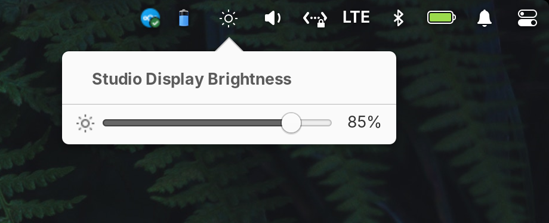

# Studio Display Brightness — wingpanel indicator

A native **elementary OS wingpanel indicator** that adds an Apple **Studio
Display** brightness control to the panel. It sits in the top bar next to Sound,
Power and Network, with its own icon and a dropdown containing a real slider —
and drives [`asdbctl`](https://github.com/juliuszint/asdbctl) in the background.

- **Scroll** over the panel icon to step brightness up/down.
- **Click** the icon for a dropdown with a native brightness **slider**.



## How it works

The Studio Display is a USB HID panel, not a normal backlight, so `asdbctl`
speaks to it over HID. That tool is a one-shot CLI (`get` / `set <0-100>`), so
the indicator:

- caches the value for instant, non-blocking UI, and
- **throttles writes** (debounced ~120 ms) so dragging the slider or fast
  scrolling doesn't hammer the display.

The indicator hides itself when no Studio Display is present.

## Install (.deb)

Download the latest `.deb` from the
[Releases page](https://github.com/dwetscher/wingpanel-indicator-studio-display-brightness/releases)
and install it:

```bash
sudo apt install ./wingpanel-indicator-studio-display-brightness_*.deb
```

Then log out and back in (or restart wingpanel with
`killall io.elementary.wingpanel`) for the icon to appear. You still need
[`asdbctl`](https://github.com/juliuszint/asdbctl) on your `PATH` (see below) —
the indicator stays hidden until it is installed and a Studio Display is
connected. The `.deb` bundles the udev rule.

> Every push builds a `.deb` in CI; tagging a release (`v*`) attaches it to a
> GitHub Release.

## Build from source

### Requirements

```bash
sudo apt install valac meson ninja-build build-essential pkg-config \
                 libgtk-3-dev libwingpanel-dev libgudev-1.0-dev
```

Plus [`asdbctl`](https://github.com/juliuszint/asdbctl) built and installed:

```bash
sudo apt install libudev-dev          # hidapi build dependency
git clone https://github.com/juliuszint/asdbctl && cd asdbctl
cargo install --path . --locked       # --locked avoids needing a newer Rust
```

This installs to `~/.cargo/bin`. `install.sh` symlinks it into `/usr/local/bin`
so wingpanel can find it (apt's cargo doesn't put `~/.cargo/bin` on the session
PATH).

### Install script

```bash
./install.sh
```

This builds the indicator, installs the module into wingpanel's indicators
directory (`sudo ninja install`), installs the udev rule (so `asdbctl` works
without sudo), symlinks `asdbctl` system-wide, and restarts wingpanel so the
icon appears.

### Manual build

```bash
meson setup build
ninja -C build
sudo ninja -C build install
killall io.elementary.wingpanel   # restarts and loads the indicator
```

The module installs as `libstudio-display-brightness.so` under
`/usr/lib/x86_64-linux-gnu/wingpanel/`.

## Uninstall

If you installed the `.deb`:

```bash
sudo apt remove wingpanel-indicator-studio-display-brightness
killall io.elementary.wingpanel
```

If you installed from source (`install.sh` / `sudo ninja install`), remove the
files explicitly — `ninja uninstall` only works if the original build dir with
its install log is still around:

```bash
sudo rm -f /usr/lib/x86_64-linux-gnu/wingpanel/libstudio-display-brightness.so
sudo rm -f /etc/udev/rules.d/20-asd-backlight.rules \
           /usr/lib/udev/rules.d/20-asd-backlight.rules
sudo udevadm control --reload-rules
killall io.elementary.wingpanel
```

This leaves `asdbctl` (and the `/usr/local/bin/asdbctl` symlink) in place, since
it isn't part of this project and the `.deb` build still needs it. Remove that
separately only if you're uninstalling asdbctl entirely.

## Troubleshooting

- **No icon in the panel** — the indicator hides when `asdbctl` is missing or no
  display is found. Confirm `asdbctl get` works (see below) and check the
  wingpanel log: `killall io.elementary.wingpanel; G_MESSAGES_DEBUG=all io.elementary.wingpanel`.
- **`asdbctl get` fails with "Permission denied"** — confirm the udev rule is in
  `/etc/udev/rules.d/`, run `sudo udevadm control --reload-rules && sudo udevadm
trigger`, and replug the display once.
- **"No Apple Studio Display found"** — the display isn't detected on USB (the
  indicator stays hidden by design).
- **Scroll direction feels wrong** — scroll up increases by default; if you use
  natural scrolling and it feels inverted, tell me and I'll wire it to the
  natural-scroll setting like the Sound indicator does.

## Acknowledgements

All the hard part — talking to the Studio Display over USB HID — is done by
[`asdbctl`](https://github.com/juliuszint/asdbctl) by
[juliuszint](https://github.com/juliuszint). This project is only a wingpanel
front-end that drives that command-line tool. The bundled udev rule
(`data/20-asd-backlight.rules`) is taken from the same project.

## License

[GPL-3.0-or-later](LICENSE)
